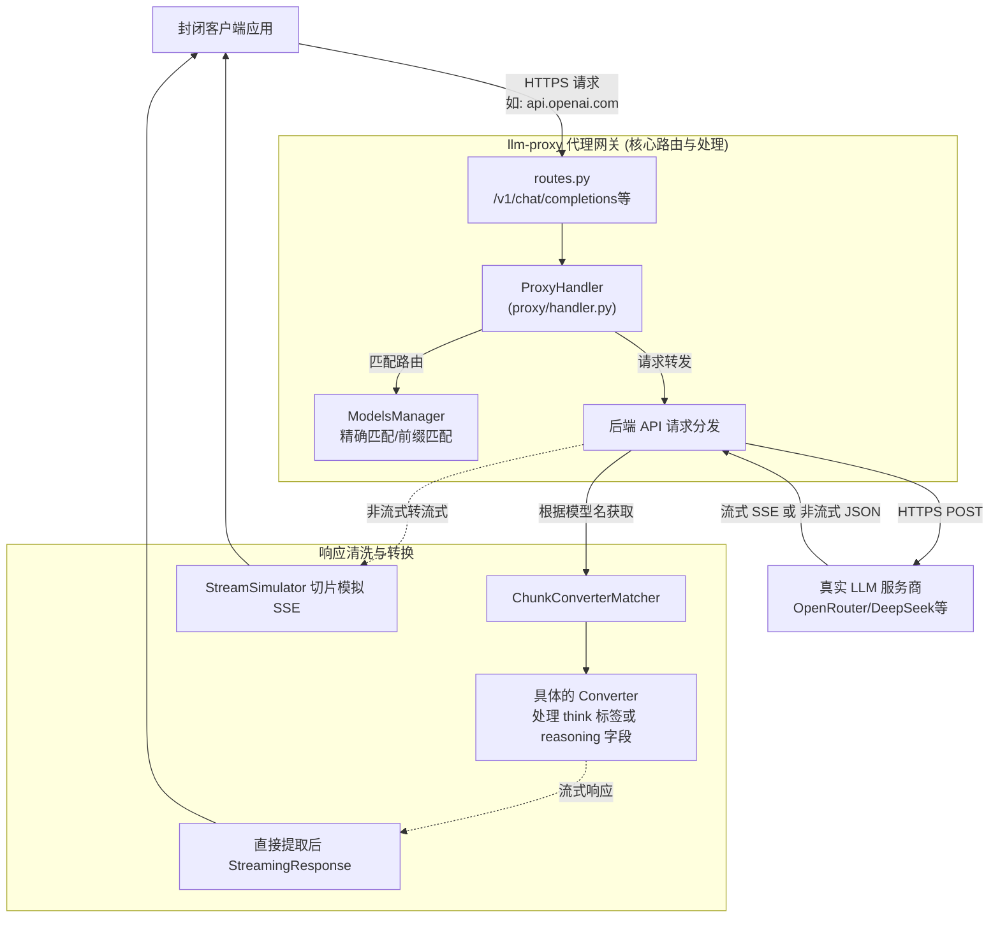

# 项目顶层开发指引 (Project Root Guide)

本文档是 `llm-proxy` 项目的**入口级开发指引**，适用于开发者与 AI Agent。
它描述了项目的顶层架构和设计原则。为了避免信息过载，具体的代码实现细节、性能优化策略和测试规范已经被**分散到各个子目录下的指引文档中**。

在进行代码修改或任务分析时，**请务必根据你要修改的代码路径，首先去阅读对应目录下的指引文档**。

## 1. 渐进式文档导航 (必须阅读)

在修改或分析具体代码前，请跳转至以下对应的专属说明文档：

- ⚙️ **核心代理与转换逻辑** (`proxy/` 目录)
  - 包含：代码关联功能介绍、响应清洗逻辑、简单的开发规范与性能优化导向等。
  - 👉 **[点击阅读: proxy/AGENTS.md](proxy/AGENTS.md)**

- 🧪 **自动化测试与数据录制** (`tests/agent/` 目录)
  - 包含：如何使用录制脚本捕获真实大模型数据，如何编写回放测试用例。
  - 👉 **[点击阅读: tests/agent/README.md](tests/agent/README.md)**

## 2. 项目顶层架构图

理解本图即可掌握 `llm-proxy` 的全局数据流转。具体的模块关联细节，请查阅 `proxy/AGENTS.md`。

## 3. 全局开发规范

无论是开发者还是 AI Agent，接手本项目请遵循以下开发范式：

1. **依赖真实源码**：每次修改核心逻辑前，应实际阅读并理解对应的源码，不要依赖过期的记忆。
2. **保持架构简洁**：本项目追求极致的高性能和简洁的代码实现，避免过度设计。对于复杂逻辑需增加清晰的注释，并尽可能使用 Pythonic 的代码风格。
3. **遵循渐进式文档原则**：
   - 如果在实现新功能时发现现有文档缺失，请**就近原则**：在修改的模块同级目录下创建或更新文档。
   - **不要**把所有的技术细节、状态机制、算法实现全部堆砌到本顶层文件中。
4. **必须通过录制回放测试**：涉及请求格式或流式解析的改动，必须配合 `tests/agent/` 下的工具跑通基于真实录制数据的回放测试。